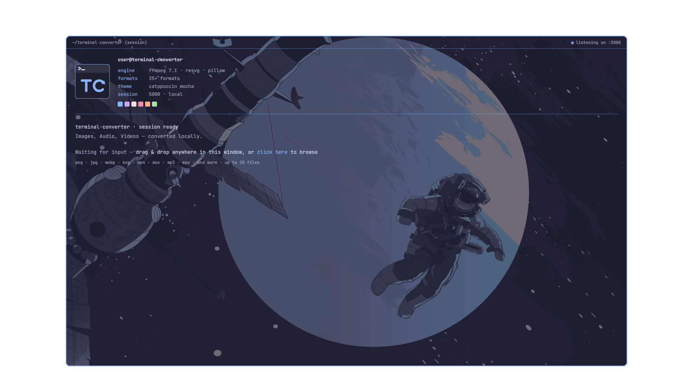
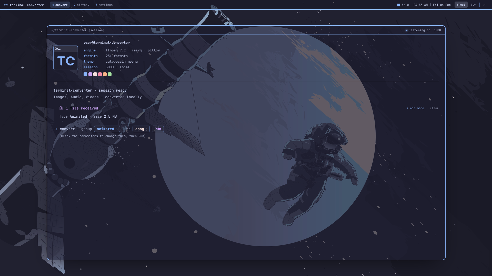
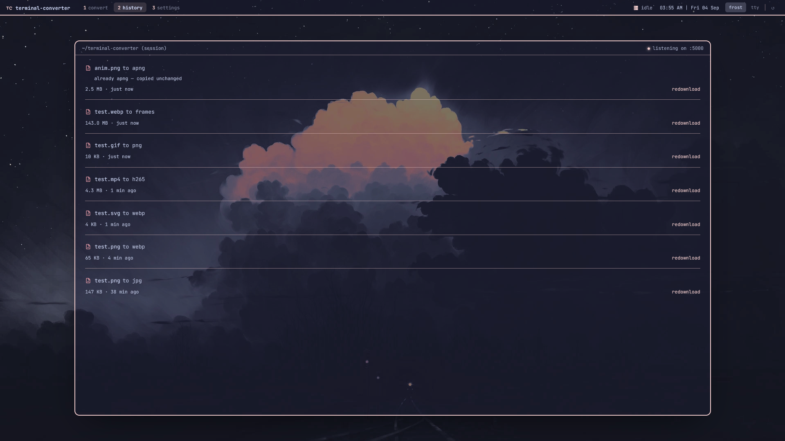
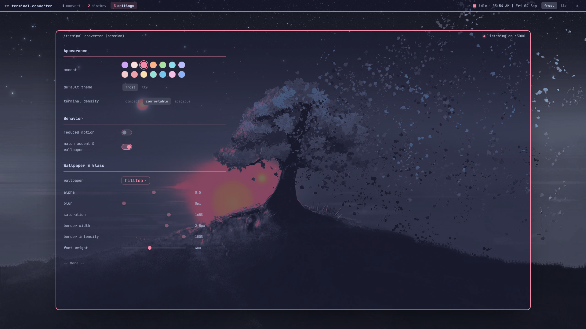
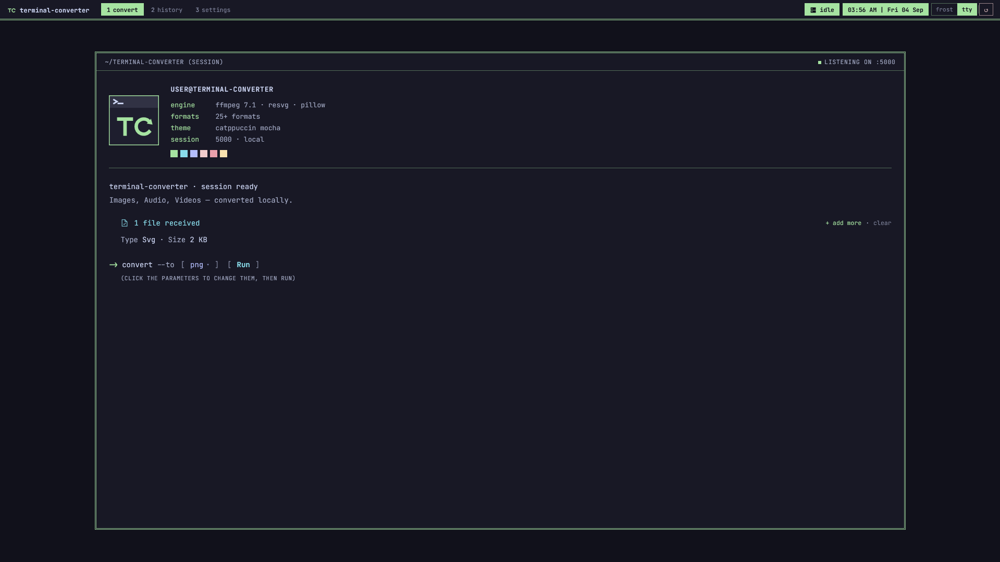
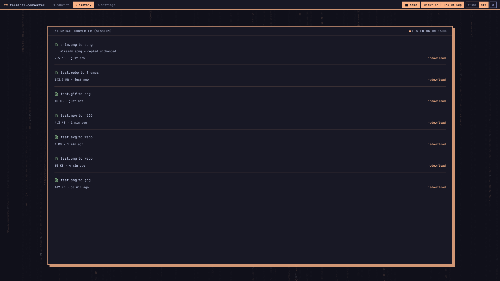
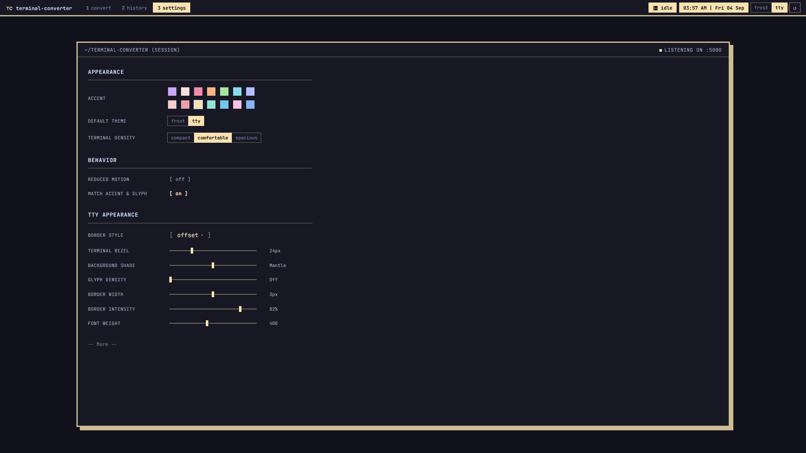

<p align="center">
  
</p>

<h1 align="center">terminal-converter</h1>

<p align="center">
  
</p>

<p align="center"><strong>A terminal-styled file converter</strong></p>
<p align="center">
  A Flask app for converting images, SVGs, audio, video, and animated media — batch conversion, live progress, and job history, running entirely on your machine.
</p>

<p align="center">
  <a href="https://term-converter.onrender.com/" target="_blank"></a>
  
  
  
  
</p>

---

## ✨ Features

* **Multi-Format Conversion:** Images, SVGs, audio, video, and animated media — see the [Format Matrix](#️-format-matrix) for full source → target coverage.
* **Content-Aware Classification:** `.webp`, `.png`, and `.avif` are ambiguous by extension alone — the app checks actual file content to tell a static image from an animated one, both client-side and server-side.
* **Batch Conversion:** Convert up to 20 files in one job, with a personal batch-size ceiling configurable under that hard limit.
* **Real Progress:** Live ffmpeg progress for video/audio/animated jobs, a lightweight size-scaled estimate for near-instant Pillow/resvg conversions, and batch position shown across multi-file jobs.
* **Cancel & Retry:** Cancel an in-flight job, or retry a failed/cancelled conversion with one click — no re-upload needed.
* **Same-Format Skip:** A source that already matches the target format is copied through unchanged instead of being re-encoded.
* **Job History:** Persisted locally across restarts, with per-job conversion logs and configurable retention.
* **Configurable Conversion Defaults:** Filename templates, resolution/fps for video → gif/webp, and a size/duration advisory for long clips.
* **Two Themes, Fully Customizable:** A glass-morphism "frost" look and a terminal-styled "tty" look, with adjustable accent colors, wallpapers, and glass tuning.

## ⚙️ How It Works

```text
┌────────────────────────┐
│   Drop / select file(s)│
└────────────┬───────────┘
             │  classified client-side
             ▼
┌────────────────────────┐
│   POST /api/convert    │
└────────────┬───────────┘
             │  job + task(s) created, queued
             ▼
┌────────────────────────┐
│ ffmpeg / Pillow / resvg│
└────────────┬───────────┘
             │  polled via GET /api/jobs/<id>
             ▼
┌────────────────────────┐
│   Download / History   │
└────────────────────────┘
```

## 📸 Interface Preview

<table width="100%">
  <tr>
    <td align="center"><br><b>Frost — Home</b></td>
    <td align="center"><br><b>Frost — History</b></td>
    <td align="center"><br><b>Frost — Settings</b></td>
  </tr>
  <tr>
    <td align="center"><br><b>TTY — Home</b></td>
    <td align="center"><br><b>TTY — History</b></td>
    <td align="center"><br><b>TTY — Settings</b></td>
  </tr>
</table>

## 🗂️ Format Matrix

| Source | Group | Targets |
| --- | --- | --- |
| Image | — | jpg, png, webp, bmp, tiff, avif, heic |
| SVG | — | png, jpg, webp |
| Audio | — | mp3, wav, flac, aac, ogg, opus, wma |
| Animated | convert | gif, webp, apng, avif |
| ↳ | thumbnail | png, jpg, webp (first frame only) |
| ↳ | frames | zip of every frame as `.png` |
| ↳ | video | mp4, webm |
| Video | video | mp4, mkv, mov, avi, webm, flv, wmv, h264, h265 |
| ↳ | audio | mp3, wav, flac, aac, ogg, opus, wma |
| ↳ | animated | gif, webp |

A kind with more than one group requires that group as a form field on `/api/convert` — the same target string can mean different things in different groups.

## 🚀 Getting Started

### 1. Install dependencies

```bash
git clone <this-repo-url>
cd terminal-converter
pip install -r requirements.txt
```

### 2. Install ffmpeg

Video, audio, and animated conversions shell out to `ffmpeg`/`ffprobe` — install it and make sure both are on your `PATH`. Everything else (Pillow, resvg, AVIF/HEIC support) is a pure Python dependency.

### 3. Run

```bash
python app.py
```

*Visit `http://127.0.0.1:5000` in your browser.*

A `config.json` is created automatically on first run (see [Configuration](#-configuration) below) — nothing to set up by hand.

## ⚡ API

| Route | Method | Description |
| --- | --- | --- |
| `/` | GET | The app itself |
| `/api/formats` | GET | Supported kinds, targets, and groups |
| `/api/inspect` | POST | Content-aware classification for ambiguous files |
| `/api/convert` | POST | Submit a batch conversion job |
| `/api/jobs` | GET | List recent jobs (powers History) |
| `/api/jobs/<job_id>` | GET | Poll a job's status and progress |
| `/api/jobs/<job_id>/cancel` | POST | Cancel an in-flight job |
| `/api/jobs/<job_id>/download` | GET | Download a completed job's output |
| `/api/jobs/<job_id>/tasks/<task_id>/retry` | POST | Retry a failed or cancelled task |

## ⚙️ Configuration

`config.json` is generated with sensible defaults on first run and can be edited directly:

| Key | Default | Description |
| --- | --- | --- |
| `job_retention_days` | `30` | How long a job's files are kept before the cleanup sweep removes them |
| `log_retention_days` | `30` | How long ffmpeg conversion logs are kept |
| `failed_input_retention_days` | `7` | How long a failed/cancelled task's input is kept, enabling one-click retry without a re-upload |
| `cleanup_on_startup` | `true` | Run the cleanup sweep once at startup, in addition to on every new job |
| `storage_dir` | `null` | Where job files are stored; `null` uses the system temp directory. If set, this **must** stay outside the project folder |
| `enable_conversion_logs` | `true` | Whether ffmpeg's output is persisted to a log file per task |

## 📁 Project Structure

```text
terminal-converter/
├── app.py                        # Flask app and routes
├── config.py                     # config.json loader
├── requirements.txt
│
├── converter/
│   ├── registry.py               # formats, kinds, groups, content-aware classification
│   ├── jobs.py                   # job/task store, conversion orchestration, cleanup, cancel/retry
│   ├── images.py                 # Pillow-based image conversion
│   ├── svg.py                    # resvg-based SVG rasterization
│   ├── video_audio.py            # ffmpeg-driven video/audio conversion
│   ├── animated.py               # gif/webp/apng/avif circle, thumbnail, and frame extraction
│   └── errors.py
│
├── templates/
│   └── index.html
│
├── static/
│   ├── css/styles.css
│   ├── js/script.js
│   └── assets/                   # wallpaper images
│
└── assets/                       # README preview images and logo source
```

## 🛠️ Tech Stack

* **Backend:** Python, Flask
* **Media:** ffmpeg / ffprobe, Pillow, resvg
* **Storage:** SQLite (job/task history)
* **Frontend:** HTML, CSS, JavaScript — no frameworks

## 📄 License

This project is licensed under the MIT License.